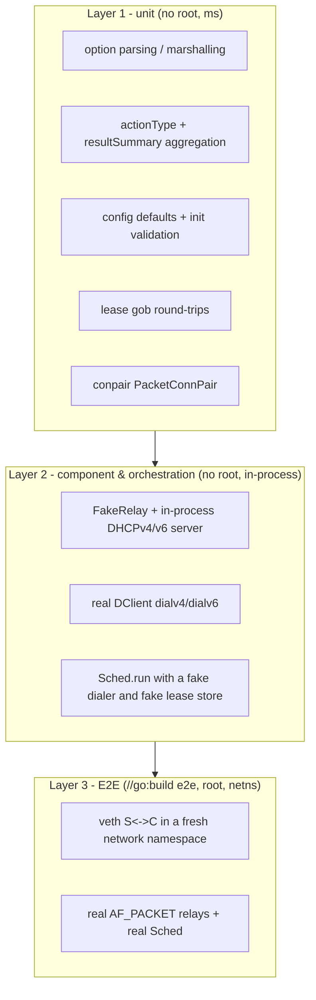

# Testing dhcplt

This document describes how dhcplt is tested. The suite is intentionally split
into layers so that the fast, always-on tests need **no root, no network, no
DHCP server, and no test-only build tags**, while the expensive end-to-end
coverage lives behind a build tag and runs in an isolated network namespace.

## Goals

- Fast feedback: `go test ./...` runs in a few seconds without privileges.
- Deterministic: no reliance on external daemons (kea) or fixed sleeps for
  correctness; deadlines and waiting are explicit.
- Test the real code: component tests exercise the actual
  `etherconn`/`nclient4`/`nclient6` stack, not a reimplementation of it.
- Isolate the hard tests: E2E raw-socket tests never leak interfaces or
  addresses onto the host.

## Layers



### Layer 1 — unit tests

Pure logic, table-driven, no I/O beyond `t.TempDir()`.

| File | Covers |
| --- | --- |
| `conf_test.go` | `newDefaultConf` defaults; all `testSetup.init` validation branches; DHCPv4/v6 custom-option parsing; message-type conversions |
| `sched_test.go` | `actionType` marshal/unmarshal; `getIAIDviaInt`; `collectResults` summary math; `buildSolicit`; `NewRequestFromAdv` |
| `lease_test.go` | `getClientIDFromL2Key`; v4/v6 lease `MarshalBinary` round-trips; `Genv6Release`; `saveLeaseToFiles` ↔ `loadLeaseFromFile` |
| `conpair/conpair_test.go` | `PacketConnPair` read/write, deadlines, `Close` |

### Layer 2 — component and orchestration tests

These exercise the real production paths in-process. Two angles:

1. **Component** (`component_test.go`): a `FakeRelay` stands in for the network
   interface, and an in-process DHCP server runs on the same relay. The real
   `DClient.dialv4` / `dialv6` (and therefore `nclient4`/`nclient6`,
   `EtherConn`, `RUDPConn`) complete a full DORA without touching a NIC.

2. **Orchestration** (`sched_orchestration_test.go`): a fake `dclient` and a fake
   `leaseStore` are injected via the production seams, so `Sched.run` is tested
   for DORA, release/3R, lease saving, and flapping — including cancellation.

The harness lives in `internal/testutil` (see below). `internal/testutil`'s own
tests (`fakerelay_test.go`) validate the relay over both IPv4 and IPv6.

### Layer 3 — E2E (`//go:build e2e && linux`)

`e2e_test.go` is build-tagged and requires root. `TestMain` re-executes the test
binary inside a freshly created network namespace (`ip netns add`), so the veth
pair and any addresses live only in that namespace. Each test creates a
`S<->C` veth pair, runs the in-process DHCP server on `S`, and runs the real
`Sched` (real `AF_PACKET` relays) on `C`, asserting `Failed == 0` and
`Success == NumOfClients`.

Configuration for the E2E runs lives in `testdata/e2e/*.yaml` and is also
validated by `testdata_test.go`, which runs in the normal (untagged) suite.

## Running the tests

Normal suite (fast, no privileges):

```sh
go build ./...
go vet ./...
go test -race -count=1 ./...
```

Component and orchestration tests only:

```sh
go test -race -count=1 -run 'TestComponent|TestSchedOrchestration' .
```

E2E (root required; compiles with the tag, skips gracefully when not root):

```sh
sudo go test -tags e2e -count=1 -run '^TestE2E' -v .
```

Compile-check the tagged files without running them:

```sh
go vet -tags e2e ./...
```

**Build prerequisites:** dhcplt links against `libpcap` through
`etherconn`'s `gopacket/pcap` dependency, so `libpcap-dev` and cgo are needed to
build and link even the unit tests (the tests never open a pcap handle). On
Debian/Ubuntu: `sudo apt-get install -y libpcap-dev`.

## The in-memory harness (`internal/testutil`)

- **`FakeRelay`** — an `etherconn.PacketRelay` that forwards Ethernet frames
  between registered `EtherConn`s over channels. It parses frames the same way
  the raw relay does (Dot1Q/QinQ VLANs, IPv4/IPv6/UDP), so `RUDPConn` receives
  fully populated `RelayReceival`s. Unicast frames go to the registration whose
  `L2EndpointKey` matches the destination MAC/VLANs/EtherType; broadcast and
  multicast frames are fanned out to matching registrations.
- **`StartDHCPv4Server`** — a `server4` server bound to a `FakeRelay` (or any
  `PacketRelay`, including a real one for E2E). `EncodedDHCPv4Handler` assigns
  an address derived from the client MAC and `MACFromAssignedIP` reverses it so
  replies need no ARP.
- **`StartDHCPv6Server`** — a `server6` server with a default handler that
  answers SOLICIT→ADVERTISE and REQUEST/RENEW/REBIND→REPLY with IA_NA and IA_PD.

## Test seams in production code

These fields are unexported and nil in normal operation; tests set them to
replace the network and the filesystem.

| Seam | Location | Purpose |
| --- | --- | --- |
| `relayFactory` / `createRelay()` | `conf.go` | inject an in-memory relay instead of `createPktRelay`; a pre-set `pktRelay` also wins |
| `clientFactory` (`dclientFactoryFunc`) | `conf.go` / `sched.go` | build `Sched` clients without any network |
| `leaseStoreImpl` / `getLeaseStore()` | `conf.go` / `lease.go` | swap the file-backed lease store for an in-memory one |
| `dclient` interface | `sched.go` | the per-client behavior `Sched` orchestrates; `*DClient` is the production impl |

`Sched.summary` is guarded by `summaryMu` and read via `summaryString()` when
printing, because `collectResults` updates it from another goroutine.

## Continuous integration

`.github/workflows/main.yml` has two jobs:

- **test** (every push/PR to `master`): installs `libpcap-dev`, then runs
  `go build ./...`, `go vet ./...`, and `go test -race -count=1 ./...`.
- **e2e** (nightly `schedule` and `workflow_dispatch`): installs `libpcap-dev`
  and runs `sudo -E env "PATH=$PATH" go test -tags e2e ...`.

`.travis.yml` was removed.

## Conventions

- Prefer table-driven subtests with `t.Parallel()` where safe.
- Use `t.TempDir()` and `t.Cleanup()` instead of manual teardown.
- Avoid `time.Sleep` for synchronization; wait on channels, `WaitGroup`s, or
  explicit conditions with a deadline.
- Never require root or an external daemon in the untagged suite.

## Known limitations / follow-ups

- The E2E tests are not executed by the default `go test ./...`; they need root
  and a Linux host (they are exercised by the nightly CI job).
- There is no Windows/arm64 build matrix: the project needs cgo + libpcap, and
  the Windows path is currently broken at the `nclient4` dependency level
  (no `NewRawUDPConn` on Windows).
- The relay returns `RelayTypeAFP` and is permissive with broadcast fan-out;
  tests use disjoint client MACs per relay.
